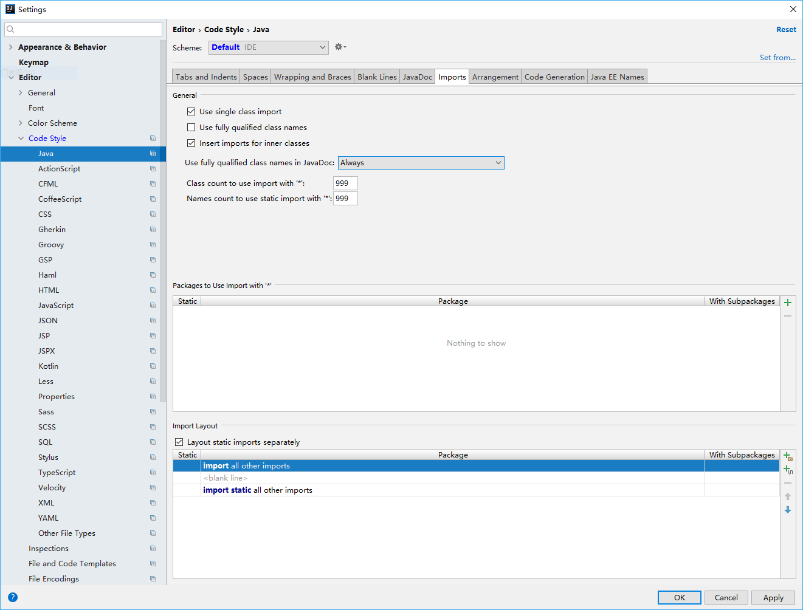

## {{page.title}}

### 1. 开发环境设置
&emsp;&emsp; [OpenDaylight官方WIKI网站](https://wiki.opendaylight.org/view/Main_Page)上有关这部分的教程很详细。
1. 安装JDK    
&emsp;&emsp;编译OpenDaylight的控制器和组件需要使用JDK1.8。安装完成后，注意正确设置JAVA_HOME、JRE_HOME和JAVA_CLASS等环境变量，并在环境变量PATH中加入“%JAVA_HOME%\\bin;”。
1. 安装Maven    
&emsp;&emsp; OpenDaylight使用[Apache Maven](http://maven.apache.org/)管理依赖包。当前版本是3.5.2，下载和安装后，需要设置系统的环境变量M2_HOME“=PATHTO\\安装路径”，并在PATH中加入“%M2_HOME%\\bin;”。    
1. 安装Intellij IDEA   
&emsp;&emsp;Intellij IDEA是收费的，不过可以从官网下载免费的社区版[Intellij IDEA Community edition](https://www.jetbrains.com/idea/download/download-thanks.html?platform=windows&code=IIC)。安装后，还要进行一些设置。
    - 根据自己的喜好设置快捷键    
    &emsp;&emsp;经由操作File -> Settings -> IDE settings -> Keymap可设置。
    - 使用4个空格符号替换Tab字符    
    &emsp;&emsp;依次进入File -> Settings -> Editor -> Code Style -> Java -> Tabs and Indents选项页，取消“Use Tab Character”的选择，并将“Tab size:”和“Indent:”都设置为4。
    - 导入项目时不使用通配符"\*"    
    &emsp;&emsp;依次进入File -> Settings -> Editor -> Code Style -> Java -> Imports。 选中“Use single class import”，并将“Class count to use import with '\*'” 和“Names count to use static import with '\*'”都设置成999。
    - 导入规则设置    
    &emsp;&emsp;依次进入File -> Settings -> Editor -> Code Style -> Java -> Imports。 移除页面下方表中所有以符号“-”标记的规则，并添加规则：
```
import static all other imports
<blank line>
import all other imports
```
    设置结果类似下图：

### 2. 下载源码
&emsp;&emsp;从[官网]()或[github](https://github.com/opendaylight/)下载需要编译的OpenDaylight组件源码，如controller、netconf、dlux、yang等。

### 3. 导入Intellij
&emsp;&emsp;使用Intellij IDEA时，项目的“导入”非常简单，只需在“file->Open”打开的窗口中，选择待导入项目根文件夹中的“\*.pom”文件即可。
- 配合Git


1. Intellij detects automatically the project is working with Git and its settings, and the right click menu adjusts to the Git integration. If you see in right bottom corner "git:master" (or whatever branch you're currently working on) - then it's all set. If it didn't detect, select "enable version control" in the VCS top menu option.

2. Git blame - the equivalent of that in IntelliJ is called "annotate". In any class, stand on a grey column on left side of class (where breakpoints/bookmarks are), right click-->Annotate. Or - right click in any class, select Git --> Annotate (see attached snapshot)
Bonus #1: stand on the annotated pane with names, left click any change --> a dialog with all files changed in that commit will open. You can right click all of them, compare different revisions, etc.
Bonus #2: right click a change in same annotated pane -> you'll see "copy revision number" - handy for searching the patch in gerrit... Bonus #3: the annotate option is also available in the diff windows

3. Git log -p <file> (seeing commit history of a specific file) The equivalent in IntelliJ: right click any class/file, select Git-->show history. It will be opened in a separate pane under the class. You can select with mouse+ctrl several revisions and compare them.

4. Checkout branch Right click --> Git -->Checkout branch (note the drop down list with all branches ...) or "as new branch" to create a new one

5. See all changed files (git status) On most bottom pane of Intellij, you'll see "find,run,debug,todo,version control,changes" Select Changes --> local changes tab. You will see all files that were changed on your file system since last commit. Of course you can right click them--> show diff to see what was changed, etc.

6. Reverting a file ("forgetting" all changes since last commit) or what git calls : "git checkout filename" Stand on class/file -right click --> Git --> Revert.

### 4. 编译
&emsp;&emsp;编译OpenDaylight时，需要指定特定的MVN远程仓库位置，若希望与其它项目分离，可以通过项目设置OpenDaylight专用的本地仓库。本节后续文本中以“ODLROOTPATH”代替OpenDaylight源码本地存储位置的根文件夹，各个组件源码亦存放在该文件夹的子文件夹中。
1. 使用独立的MVN本地仓库
    - 建立本地仓库的存储位置，例如："ODLROOTPATH\\mvn_conf\\repository"；
    - 拷贝文件“ODLROOTPATH\\odlparent\\settings.xml”到文件夹“ODLROOTPATH\\mvn_conf”中。

    如果不使用独立的本地MVN仓库，只需将文件“ODLROOTPATH\\odlparent\\settings.xml”到用户文件夹“.m2”中。
1. 配置Maven
&emsp;&emsp;如果Intellij的窗口中没有
First, verify Intellij is using the correct version and installation of Maven in case you have several versions installed. In order to check it, there are 2 options to reach Maven menu:
1. on right side of Intellij, there is a button named "Maven projects". After the maven menu opens, on its top there's option "maven settings".
2. the same "maven settings" option can be reached via Project Settings --> Maven. The "Settings" button is available under the top menu.
Configure convenient shortcuts for running the compilation/build:
Run --> Edit configurations --> Add new configuration (select Maven)
Give it a meaningful name (such as "build including distribution/build with tests")
Fill the working directory (where the parent/root pom.xml is located)
Fill goals in the command line field (for example : clean install)
Fill profiles if exist
If you need to set any -D flags , it is available in the Runner tab

Now you can always select this configuration from the combo box in the main Intellij pane, and press "run" (the green triangle) - it is equivalent to running "mvn clean install ... " from the command line.

Please note you can create and use several different configurations with different names. For example create a "quick" profile with mvn clean install -Pq.

Refreshing configuration:
Sometimes after fetching changes that involve pom changes, Intellij will detect that a refresh/reimport is needed. It will popup "Import changes/enable auto import" options. Enabling auto import is a good choice. If for some reason there's a need to reimport all maven configurations without any external changes detected, it is possible by right click menu --> Maven --> Reimport

### 5. 运行
&emsp;&emsp;在命令窗口中，到项目构建目标文件夹中，执行启动文件即可。

### 6. 调试
